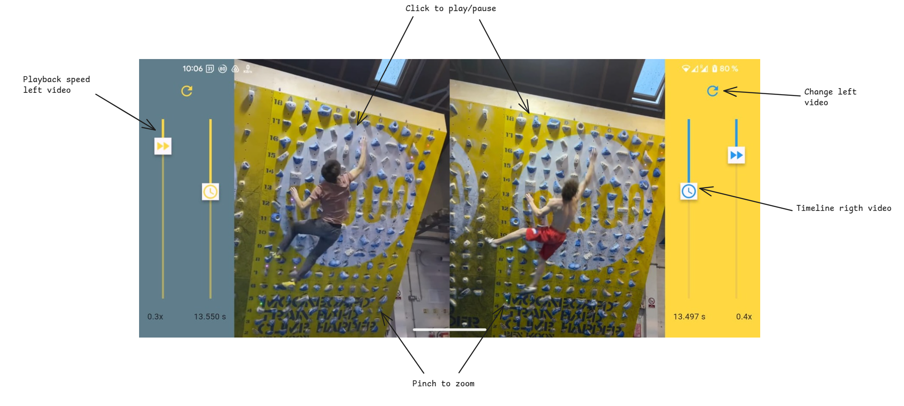

# Crux Sync

Crux Sync is a Flutter application for comparing two videos side-by-side.

## Usage

This application allows you to load and control two videos simultaneously, making it easy to compare them. Here's how to use the interface:

1. **Load Videos**: Tap the refresh icon on the top of each video section to select a video file from your device.
2. **Play/Pause**: Tap the video to play or pause it.
3. **Adjust Playback Speed**: Use the vertical slider with the "fast forward" icon to control the playback speed.
4. **Seek**: Use the vertical slider with the "schedule" icon to seek to a specific point in the video.
5. **Zoom**: Pinch to zoom in and out of the video.

## Download

You can download the latest version of the app (APK for Android) from the following link:

[Download Latest Release](https://github.com/adrianlzt/crux-sync/releases/latest/download/crux-sync-latest.apk)
